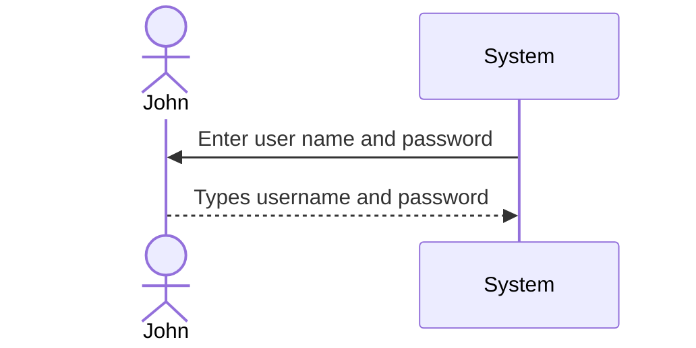

Page
5
of 5
# System Request Document
## Table of Content
1. System Request
2. Work Plan
3. Feasibility Analysis
1. Technical Feasibility
2. Organizational Feasibility
4. Requirements Definition
1. Functional Requirement
2. Non-functional Requirement
5. Logical Design
1. Sequence Diagram
2. Use Cases
3. Process Modeling (Data Flow Diagram)
1. Level 0 Diagram
2. Level 1 Diagram
3. Level 2 Diagram
4. Level 3 Diagram
5. Level 4 Diagram
6. Level 5 Diagram
4. Data Modeling (Entity Relationship Diagram)
5. Structure Chart Diagram
6. Appendices
## Executive Summary
One of Messiah University's fundamental values is the importance of community. With this in mind, our team of cybersecurity students wanted to create a system to allow student clubs to share information about upcoming events with students in a simple, streamlined manner. The idea took shape as College Connect, a program that allows clubs to post event information on a virtual bulletin board. This system request document provides the necessary details about our project, including technical/organizational feasibility, requirements, data models, timeline, and use cases, as detailed in the table of contents. If you have any questions, please do not hesitate to reach out to the team, and we will be happy to answer any questions about our project. 

## 1. System Request

**Project Sponsor:** Messiah University Cybersecurity Students: Jess Donahoue, Carolina Hatch, Brandan Snook, and Nathan Steinbach 

**Business Need:** This project has been initiated to improve the community aspect of Messiah University. Messiah has many clubs that host events nearly every week. While clubs can communicate with users via social media and emails, many students ignore emails and only follow specific clubs. This program allows clubs to upload their events to a community calendar. This means their events will be displayed to all users, regardless of if they subscribe to the club. This will enable a greater level of communication and involvement between clubs and users, which will strengthen the community on our campus.

**Business Requirements:** This system shall allow clubs to post details of upcoming events to a community bulletin board. Students will be able to subscribe to the clubs they choose. This will allow them to receive notifications about events from these clubs. Clubs and students will be different types of accounts with different privileges and abilities. 

**Business Value:** This project will allow for greater connectivity between clubs and students. This will increase student participation in club activities, helping both parties build strong communities in line with Messiah University's desire to foster student connections. 
**Special Issues or Constraints:** Although student accounts will be connected to Messiah, we will need to ensure that no FERPA data is pulled by the app. Additionally, we will need to ensure a great amount of both club and student support for this app or it will fail early on. 
## 2. Work plan
> The original work plan revised after having completed the
analysis phase.
### Gantt Chart
```mermaid
gantt
dateFormat YYYY-MM-DD
title YOUR PROJECT TITLE HERE
excludes weekends
%% (`excludes` accepts specific dates in YYYY-MM-DD format,
days of the week ("sunday") or "weekends", but not the word
"weekdays".)  
section Section A
Task A.1 : des1, 2014-01-06,2014-01-08
Task A.2 : des2, 2014-01-09, 3d
Task A.3 : des3, after des2, 5d
Task A.4 : des4, after des3, 5d
section Section B
Task B.1 : des5, 2014-01-07,2014-01-09
Task B.2 : des6, 2014-01-10, 7d
Task B.3 : des7, after des3, 2d
Task B.4 : des8, after des7, 5d
section Section C
Task C.1 : des9, 2014-01-06,2014-01-08
Task C.2 : des10, 2014-01-09, 3d
Task C.3 : des11, after des2, 5d
Task C.4 : des12, after des3, 5d
```
## 3. Feasibility Analysis
> *Reference Chapter 1*
> A revised feasibility analysis, using the information from the
analysis phase.
### 3.1 Technical Feasibility
### 3.2 Organizational Feasibility
## 4. Requirements Definition
> *Reference Chapter 3*
> A list of the functional and nonfunctional business
requirements for the system.
### 4.1 Functional Requirements:
### 4.2 Nonfunctional Requirements:
1. **Operational**
2. **Performance**
3. **Security**
4. **Cultural and political**
## 5. Logical Design
> A set of use cases that illustrate the basic processes that the
system needs to support.
### 5.1 Sequence Diagram

### 5.2 Use Cases
> *Reference Chapter 4*
#### Use Case Name: Your use case name
> __ID__ :
> __Priority__ :
> __Actor__ :
> __Description__ :
> __Trigger__ :
> __Type__ :
> __Preconditions__ :
> 1. Condition 1
> 2. Condition 2
> 3. ......
| Normal Course: | Information for Steps |
|---|---|
|1.0 Finalize Parts Request||
|1. Parts room clerk opens the parts . . . | <--- Parts Request
record |
|2. Parts room clerk verifies . . . |<--- Shop Work Order Record|
> __Postconditions__ :
> 1. Condition 1
> 2. Condition 2
> 3. ......
|Summary Inputs|Source|Summary Outputs| Destination|
|---|---|---|---|
|Final parts verification|Parts room clerk|Parts request record|
Parts room clerk|
|Date/time completion|Parts room clerk|Shop work order record|
Shop work order datastore|
|||Work Order ready notice|Technician|
### 5.3 Process Model (Data Flow Diagram)
> A set of process models and descriptions for the tois system
that will be replaced.
### 5.4 Data Model (Entity Relationship Diagram)
> *Reference Chapter 5*
> A set of data models and descriptions for the tois system that
will be replaced.
### 5.4 Structure Chart Diagram
> *Reference Chapter 9*
## 6. Appendices
> These contain additional material relevant to the proposal,
often used to support the recommended system. This might include
results of a questionnaire survey or interviews, industry reports
and statistics, etc.
